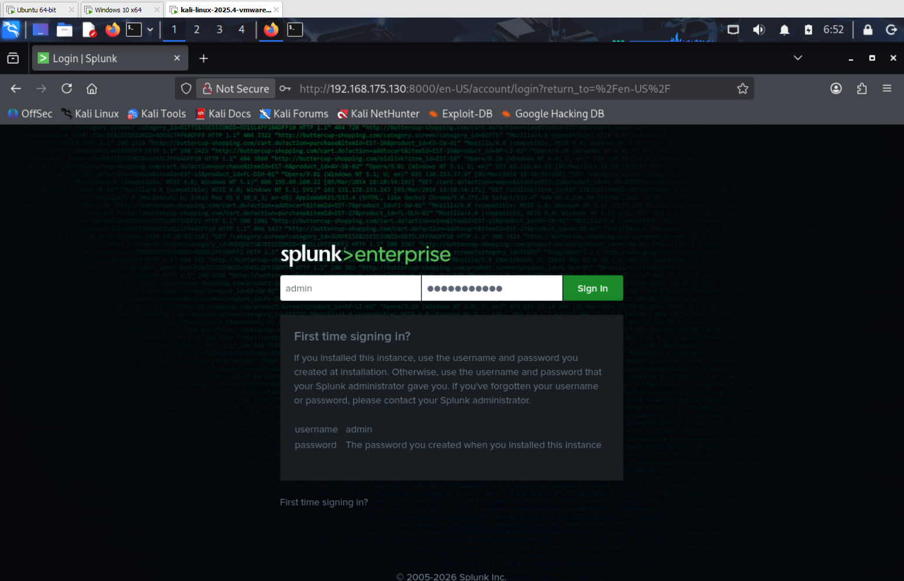
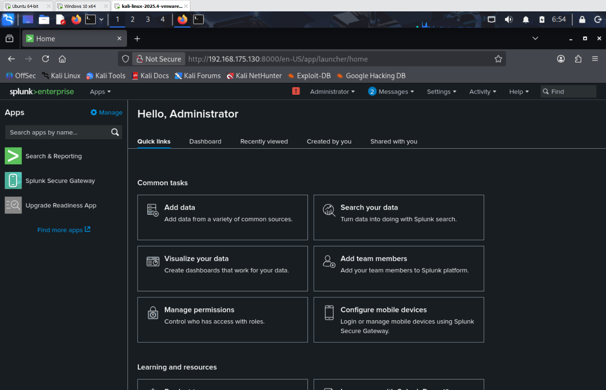
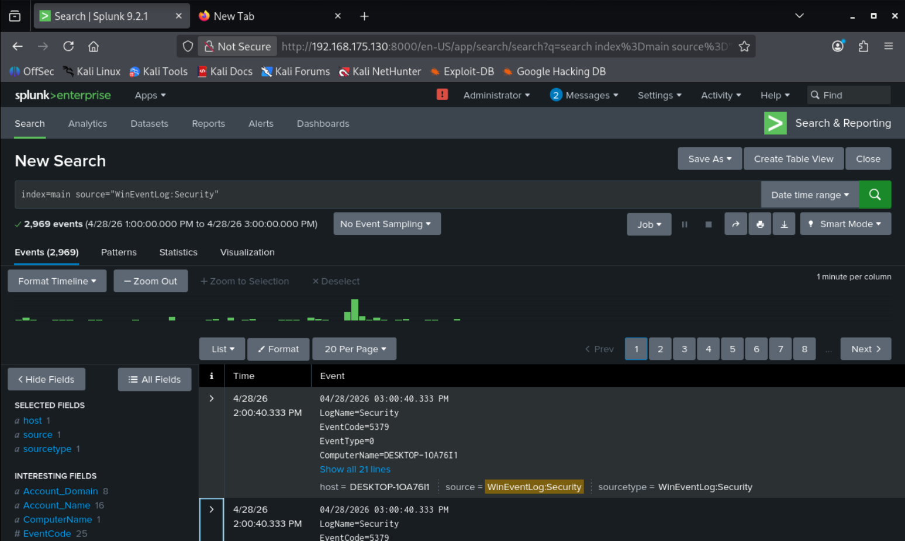
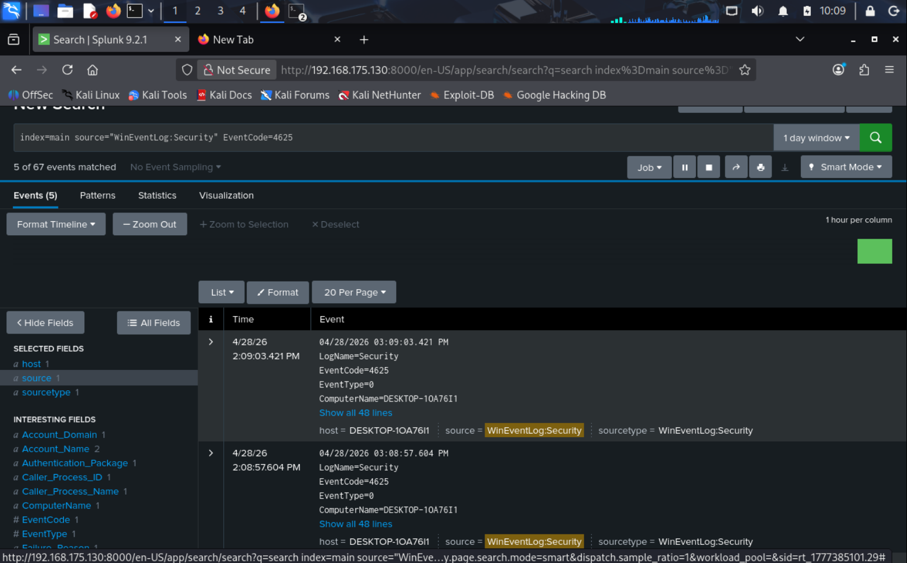
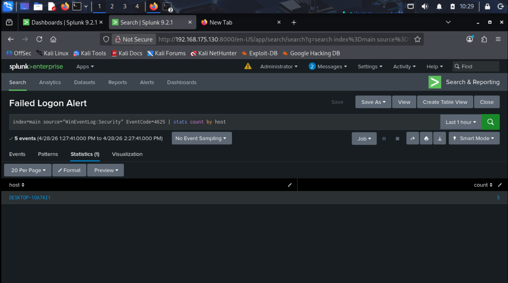
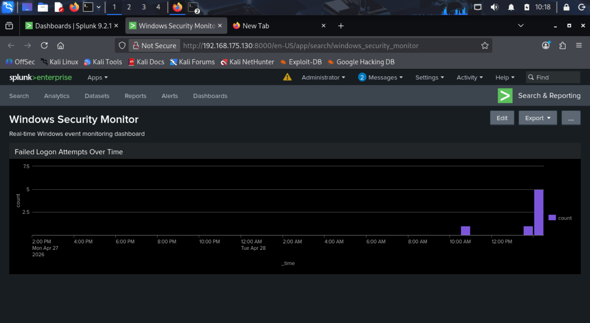
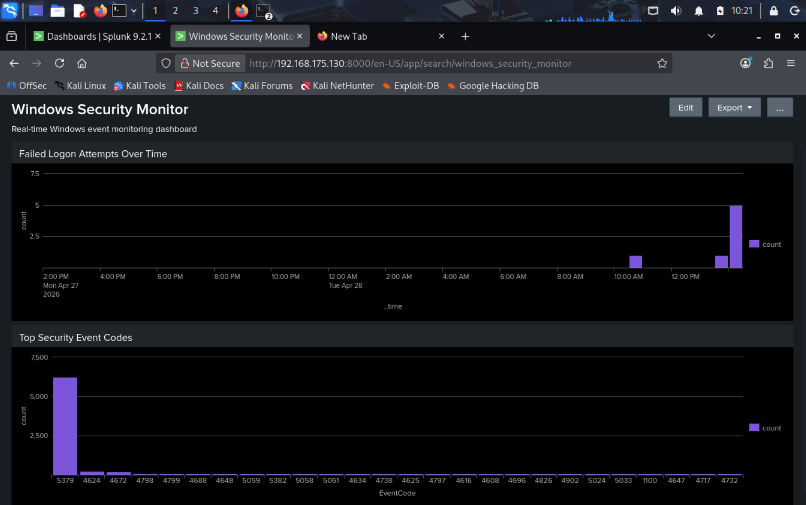
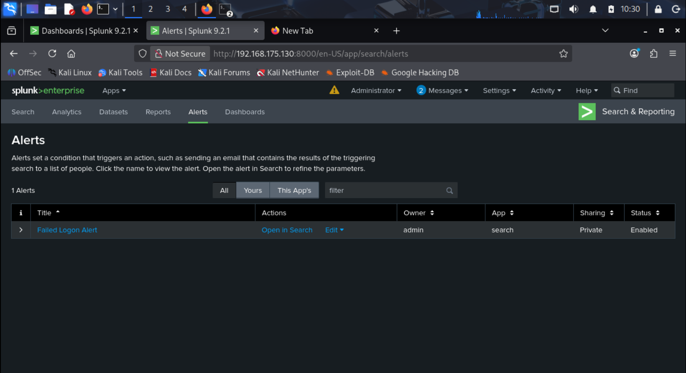

# Splunk SIEM Lab

## Overview
A Windows event log ingestion and threat detection lab built using Splunk Enterprise deployed on an Ubuntu SIEM VM. Windows Security, System, and Application logs are forwarded in real time via Splunk Universal Forwarder, enabling live threat detection, dashboard visualisation, and automated alerting - simulating a real enterprise SOC environment.

---

## How It Works

1. Splunk Enterprise 9.2.1 deployed on Ubuntu SIEM VM (192.168.175.130)
2. Splunk Universal Forwarder installed on Windows 10 target VM (192.168.175.129)
3. Windows Security, System, and Application logs forwarded to Splunk on port 9997
4. SPL queries used to detect failed logon attempts (EventCode 4625)
5. Custom dashboard built to visualise failed logons and top security event codes
6. Automated alert configured to trigger when failed logons exceed threshold

---

## Requirements

- Splunk Enterprise (free trial from splunk.com)
- Splunk Universal Forwarder (Windows)
- Ubuntu Linux (SIEM/indexer host)
- Windows 10 target machine
- VMware Workstation or any hypervisor

---

## Lab Environment

| Component | Details |
|---|---|
| SIEM Host | Ubuntu 24.04 (192.168.175.130) |
| Log Source | Windows 10 Build 19045 (192.168.175.129) |
| Splunk Version | Enterprise 9.2.1 |
| Forwarder | Splunk Universal Forwarder 10.2.2 |
| Network | VMware NAT (192.168.175.0/24) |
| Receiving Port | 9997 |

---

## Key SPL Queries

### All Windows Security Events
index=main source="WinEventLog:Security"

### Failed Logon Detection (EventCode 4625)
index=main source="WinEventLog:Security" EventCode=4625

### Failed Logons Over Time
index=main EventCode=4625 | timechart count

### Top Security Event Codes
index=main source="WinEventLog:Security" | stats count by EventCode | sort -count

### Failed Logons by Host
index=main source="WinEventLog:Security" EventCode=4625 | stats count by host

---

## Dashboard - Windows Security Monitor

Built a custom Splunk dashboard with two panels:
- Failed Logon Attempts Over Time - timechart showing 4625 events across 24 hours
- Top Security Event Codes - column chart showing most frequent event codes by volume

---

## Alert Rule — Failed Logon Alert

| Setting | Value |
|---|---|
| Trigger | EventCode 4625 count > 3 |
| Schedule | Every 5 minutes |
| Severity | High |
| Action | Add to Triggered Alerts |
| Status | Enabled |

Triggers when more than 3 failed logon attempts are detected on a Windows host within 5 minutes — indicating a potential brute force or credential stuffing attack.

---

## Screenshots

### Splunk Login

### Dashboard Setup Complete

### Windows Security Logs Flowing In

### Failed Logon Events Detected (EventCode 4625)

### Failed Logon Alert Search

### Dashboard - Failed Logon Attempts Over Time

### Dashboard - Full View with Both Panels

### Alert Listed as Enabled

---

## Key Learnings

- Splunk Universal Forwarder enables seamless real-time log shipping from Windows to a centralised SIEM
- EventCode 4625 is the primary Windows Security event for failed logon detection — a core indicator of brute force activity
- SPL (Splunk Processing Language) allows fast and flexible querying across large volumes of log data
- Custom dashboards turn raw log data into actionable visual intelligence for SOC analysts
- Automated alerts reduce analyst workload by proactively flagging suspicious activity without manual searching

---

## Environment

- SIEM OS: Ubuntu 24.04 LTS
- Splunk: Enterprise 9.2.1
- Forwarder: Splunk Universal Forwarder 10.2.2
- Target: Windows 10 (Build 19045.6456)
- Hypervisor: VMware Workstation 17 Pro
- Network: VMnet8 NAT (192.168.175.0/24)

---

## Related Projects

- [Home SOC Lab](https://github.com/Asimsvictus/home-soc-lab)
- [Vulnerability Scanner Lab](https://github.com/Asimsvictus/vulnerability-scanner-lab)
- [Network Traffic Analyser](https://github.com/Asimsvictus/network-traffic-analyser)
- [Phishing Analysis Toolkit](https://github.com/Asimsvictus/phishing-analyser)
- [CTF Writeups](https://github.com/Asimsvictus/ctf-writeups)
